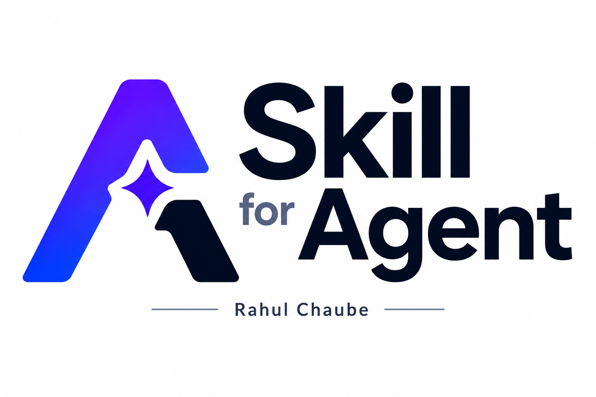
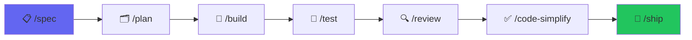

<div align="center">



# 🤖 Skills for Agents

### Production-grade AI agent workflow system for shipping software faster

[](https://github.com/Rahulchaube1/-Skills-for-Agents/stargazers)
[](https://github.com/Rahulchaube1/-Skills-for-Agents/network)
[](LICENSE)
[](https://github.com/Rahulchaube1/-Skills-for-Agents/releases)
[](https://github.com/sponsors/Rahulchaube1)

**Works with:** Claude Code &bull; Cursor &bull; Gemini CLI &bull; Windsurf &bull; GitHub Copilot &bull; Any AI Agent

[⭐ Star this repo](#) &bull; [🚀 Quick Start](#-quick-start) &bull; [📖 Docs](#-skill-library) &bull; [💬 Discussions](https://github.com/Rahulchaube1/-Skills-for-Agents/discussions)

</div>

---

## 🔥 What is Skills for Agents?

> **Most AI coding assistants know *how* to write code. Skills for Agents teaches them *how to ship it.*.**

Skills for Agents gives developers and AI coding agents a **structured operating system** for delivering reliable software — from first spec to production launch. It replaces vague prompting with repeatable, verifiable engineering workflows.

```
/spec → /plan → /build → /test → /review → /ship
```

---

## ✨ Why Developers Love It

| Feature | Description |
|---|---|
| 🔄 **Workflow-first** | 7 lifecycle slash commands with built-in verification gates |
| 🛡️ **Production-grade** | Testing, security, performance, and release discipline baked in |
| 🤝 **Universal compatibility** | Works across all major AI coding agents |
| 📚 **64 reusable skills** | Pre-built, battle-tested skill library ready to use |
| 🕵️ **3 specialist agents** | `code-reviewer`, `test-engineer`, `security-auditor` |
| ⚡ **Ship faster** | Reduce back-and-forth with agents by 10x |

---

## 🚀 Quick Start

### Claude Code
```bash
# Install the plugin
git clone https://github.com/Rahulchaube1/-Skills-for-Agents.git
cp -r .Skills-for-Agents/.claude ~/ 
```

### Cursor / Windsurf / Copilot
```bash
git clone https://github.com/Rahulchaube1/-Skills-for-Agents.git
# Apply the workflow patterns from the /skills directory to your agent
```

---

## ⚙️ The 7-Stage Development Lifecycle



| Command | Purpose |
|---|---|
| `/spec` | Define the change clearly with acceptance criteria |
| `/plan` | Break work into small, verifiable tasks |
| `/build` | Implement in thin, reviewable slices |
| `/test` | Prove behavior with evidence |
| `/review` | Apply quality, security, and maintainability checks |
| `/code-simplify` | Clean up before shipping |
| `/ship` | Release notes, rollout, and recovery planning |

---

## 📚 Skill Library

> **64 production skills** across 7 categories

| Category | Skills |
|---|---|
| 📋 Specification | `spec-driven-development`, `requirements-analysis`, `acceptance-criteria` |
| 🗂️ Planning | `planning-and-task-breakdown`, `incremental-implementation` |
| 🔨 Building | `incremental-development`, `api-design`, `database-patterns` |
| 🧪 Testing | `test-driven-development`, `integration-testing`, `e2e-testing` |
| 🔍 Review | `code-review-and-quality`, `performance-profiling` |
| 🛡️ Security | `security-and-hardening`, `dependency-auditing` |
| 🚢 Shipping | `shipping-and-launch`, `rollback-planning`, `monitoring-setup` |

---

## 🕵️ Specialist Agents

<table>
<tr>
<td align="center" width="33%">

### 🔍 Code Reviewer
Automatic code quality analysis with actionable feedback and severity ratings

</td>
<td align="center" width="33%">

### 🧪 Test Engineer
Generates comprehensive test suites including edge cases and regression tests

</td>
<td align="center" width="33%">

### 🛡️ Security Auditor
Deep security scanning for vulnerabilities, misconfigurations, and CVEs

</td>
</tr>
</table>

---

## 📊 Skills for Agents vs. Plain Prompting

| | Plain Prompting | Skills for Agents |
|---|---|---|
| Repeatability | ❌ Varies every run | ✅ Consistent workflow |
| Verification | ❌ Trust the AI | ✅ Built-in gates |
| Security | ❌ Easily forgotten | ✅ Baked into every step |
| Team adoption | ❌ Personal style | ✅ Shared standards |
| Production-ready | ❌ Maybe | ✅ Always |

---

## 🌟 Getting Started — Best Skills for Beginners

```bash
# Start with these core skills:
1. spec-driven-development    # Always start with a clear spec
2. planning-and-task-breakdown # Break it down before coding
3. test-driven-development     # Write tests first
4. code-review-and-quality     # Review before merging
5. security-and-hardening      # Secure every feature
6. shipping-and-launch         # Ship with confidence
```

---

## 🤝 Contributing

We welcome contributions! See [CONTRIBUTING.md](CONTRIBUTING.md) for guidelines.

```bash
# Fork, clone, create branch, submit PR
git clone https://github.com/YOUR_USERNAME/-Skills-for-Agents.git
git checkout -b feature/my-new-skill
# Add your skill to /skills directory
git push origin feature/my-new-skill
```

---

## ❤️ Support This Project

If Skills for Agents helped you ship better software, consider supporting it:

[](https://github.com/sponsors/Rahulchaube1)
[](https://buymeacoffee.com/rahulchaube)

⭐ **Star this repo** to help others discover it!

---

## 📜 License

MIT License — see [LICENSE](LICENSE) for details.

---

<div align="center">

Made with ❤️ by [Rahul Chaube](https://github.com/Rahulchaube1)

**If this helped you, please ⭐ star the repo — it means the world!**

</div>


---

## 📋 Changelog

### v1.1.0
- Added workflow diagram and badge shields
- Improved documentation structure
- Added sponsor and funding support

### v1.0.0
- Initial release with core agent skills
- Support for Claude Code, Cursor, Gemini CLI, Windsurf, GitHub Copilot
